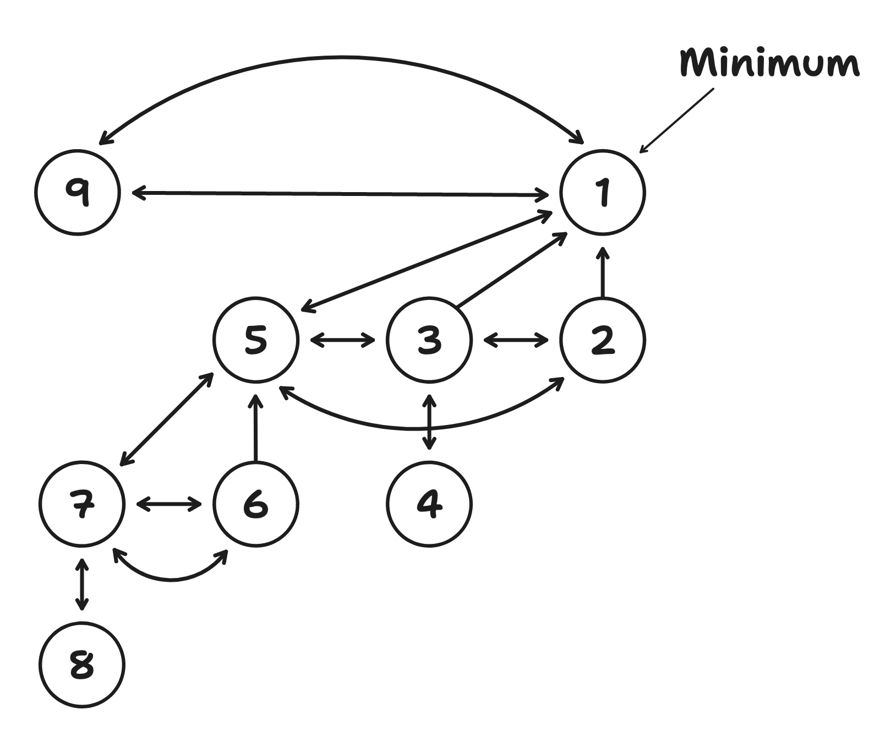

## Overview

`fibheap` is small and simple Fibonacci Heap implementation, written in Go.

It can be utilized as a min or max heap, depending on the implementation of the `Item.Less` method.

### Internal Representation

The heap itself is internally represented as a doubly linked circular list of nodes.
Parent nodes have references to the left-most child. Each child has a reference to their parent.

An example heap representation after adding elements `[0, 1, 2, 3, 4, 5, 6, 7, 8, 9]`, and removing the lowest
element (`0`):


### Benchmarks

```bash
goos: darwin
goarch: amd64
pkg: github.com/madz-lab/fibheap
cpu: Intel(R) Core(TM) i5-1038NG7 CPU @ 2.00GHz
BenchmarkHeap_Push1000-8      	   27565	     43614 ns/op
BenchmarkHeap_Push10000-8     	    2434	    486338 ns/op
BenchmarkHeap_Push100000-8    	     196	   6143537 ns/op
BenchmarkHeap_Push1000000-8   	      20	  53343451 ns/op
BenchmarkHeap_Pop1000-8       	    1279	    930076 ns/op
BenchmarkHeap_Pop10000-8      	      84	  14635011 ns/op
BenchmarkHeap_Pop100000-8     	       5	 251245856 ns/op
BenchmarkHeap_Pop1000000-8    	       1	4416738056 ns/op
PASS
ok  	github.com/madz-lab/fibheap	17.905s
```